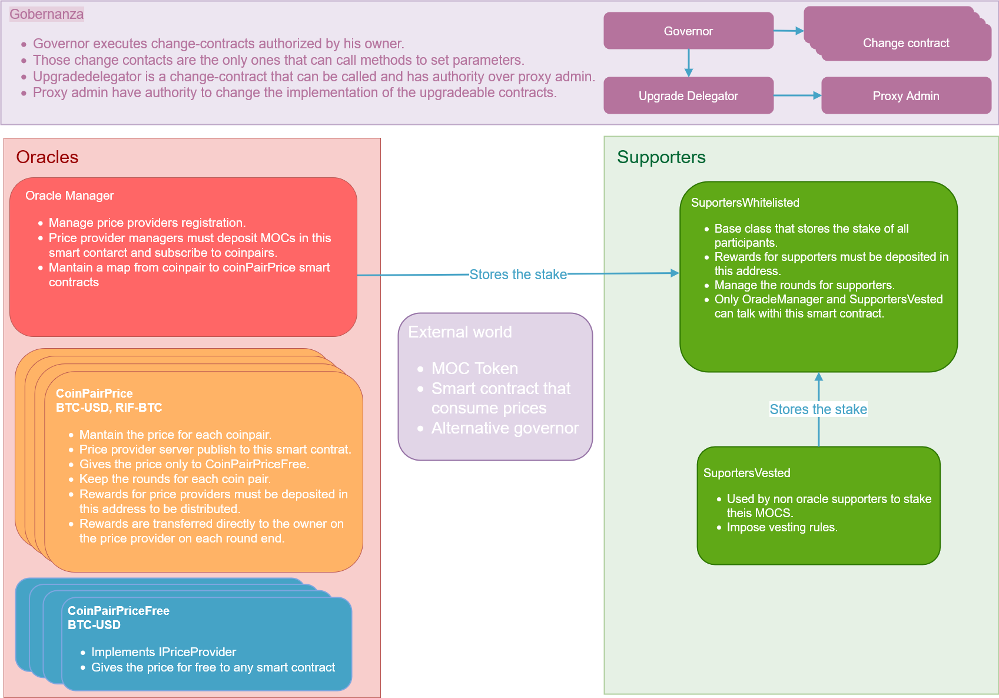

# MONEY ON CHAIN

**Descentralized Oracle System**

## Overview

This repository contains the source code for the Money On Chain Descentralized Oracle system.

The objective of this system is to provide on-chain price for our tokens in a trustless decentralized manner. 

We describe the different components involved in this system and their interaction.

## Components

**Smart Contracts**: Which interfaces to register and approve Price Providers, start and close rounds, and publish price information on-chain by approved Price Providers.

**Price Providers**: Reference server implementation which will feed the contacts with price retrieved from exchange systems. It can determine the next price publisher, co-sign price publication messages, and call the smart contract interface to publish a new price. It is also responsible to keep the contract system running (schedules periodic tasks). 

**Supporters**: A member willing to participate in the system only with its stake. By locking their funds for a period of time they can participate from the system earnings, fees and subsidy distribution.

**WebDApp**: An browser side application which interacts with the contracts and let you configure, monitor and operate the system. 

**Exchanges**: External dependency to retrieve required prices from.

## Project Structure

* [development.md](./development.md): How to run a local development environment.
* [contracts](./contracts): The source code of the Solidity contracts that support the system.
* [contracts/scripts](./contracts/scripts): Allow to run helper processes on RSK network.
* [servers](./servers): The reference Oracle implementation along with the schedulers.
* [servers/scripts](./servers/scripts): Scripts to test servers and manually register, start round, etc... This is useful for the development environment.
* [servers/delfos](./servers/delfos): Sets up a group of price feeders working together to test the system in a single machine.
* [dapp](./dapp): Includes the code for the WebDApp which needs to be deployed to a web server.
* [scripts](./scripts): Tools to monitor and interact with the system when running over RSK network.

## Smart Contracts Design

**OracleManager**: Allows any blockchain user to register an oracle in the system and subcribe it as a price-provider for different coinpairs.

**CoinPairPrice** (one per coinpair): This contract keeps the price and is responsible to receive and validate price updates provided. Also tracks providers participation in order to provide rewards.

**Supporters**: Will track stake-period contributed by supporters and will provide a reward in compensation.

**CoinPairRegister**: A contract to setup which coinpairs will the system accept.

**Governance**: Control changes and upgrades over the contracts

## Operation

Foundation will setup and deploy contracts and will provide theirs addresses for anyone willing to participate. When minimal participants join the contracts will be "started".

### Kickoff

When a coinpair participants have reach a minimal number required to work, the 0-round will be manually started. 

### Rounds

The CoinPair contracts work on a round-basis. The top N price-provider which contribute more stake will be selected to work at the begining of each round. Each round lasts one month and it is expected for the selected providers to work to do their job the whole time of the round. 
The round will end and a new round will be started automatically. When the new round begins a new provider selection will be made.
During the round, each time a provider publish a pair-price to the contract, it will be accounted **one** point. At the same time, the contract will be receiving reward tokens which will be distributed at the end of the round proportionally to the points collected by each provider.

### Price publishing

The price publishing or posting is made by turns. The turns are selected proportionally to the stake of the participants and is determined by the previous publication-block's hash. Each hash determines a particular participants order for next publication.

When to publish a price is determined by the price change from previous publication. If the expected participant don't publish for a defined period of blocks, the following in the order defined will be allowed to publish. And this fallback scheme repeats allowing multiple providers to take fallback turn in case of being required.

To publish a price it is required the consensus from half plus one of the round-selected providers. To ask for consensus, providers connects off-chain. Willing to publish provider will create a "publish-message" including block number, price to publish, etc., and will deliver it to other providers who will validate its content and return their signature. When enough signatures is received, "publish-message" and signatures is sent to contract which will verify the agreement and set the price in accordance.

### Supporters

Supporters do have a round-system too but it is transparent for the users. Reward is collected all during a certain period, and after that it is assigned to current supporters according to their stake and will be all available for the user at the end of the following round. If the user decides to retire before it will receive a part proportional to how long it stayed in the system.
Each participant registering a price-provider will automatically also be registered as supporter and will receive proportional support-rewards as any other supporter no matter if is selected as price-provider.
